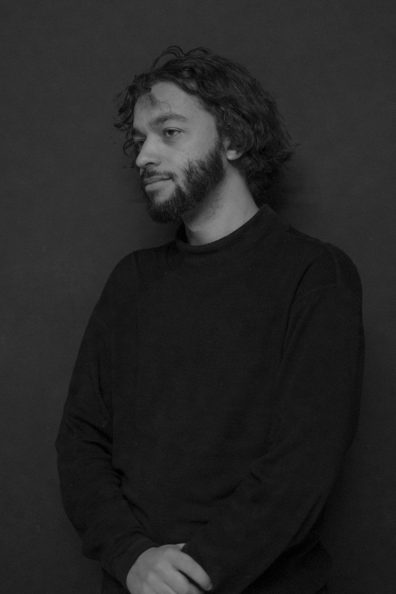

I’m a freelance UX architect and web developer in Detroit. Basically, people contract me to design, critique and code interfaces for web applications, websites and other software. I’m always looking for interesting new projects, with one caveat: I generally don’t work for ad agencies or companies making stupid, useless apps. [Read why](https://medium.com/happy-ninja/please-stop-making-worthless-apps-e893dd682a04#.mrvojhidq).

More generally, I’m a student of human nature, technology, and aesthetics. Look for me wherever these disciplines intersect. I’ll be the small, quiet guy wearing neutrals.

